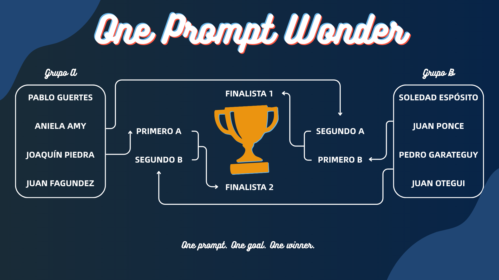

# One Prompt Wonder



## ¿Qué es One Prompt Wonder?

**One Prompt Wonder** es un evento de programación donde cada participante tiene **un único intento** para escribir un prompt a un agente de IA y construir un pequeño producto de software definido por la organización. Sin iteraciones, sin correcciones: todo depende de ese único prompt.

## Formato del torneo

El evento se disputa en dos grupos, con una fase final entre los mejores de cada grupo.

```
Grupo A  ──►  Primero A  ──┐
                            ├──► Finalista 1 ──┐
Grupo B  ──►  Segundo B  ──┘                   ├──► 🏆 Ganador
                                               │
Grupo A  ──►  Segundo A  ──┐                   │
                            ├──► Finalista 2 ──┘
Grupo B  ──►  Primero B   ──┘
```

## Participantes

### Grupo A

| Participante    | Carpeta                                      |
|-----------------|----------------------------------------------|
| Pablo Guartes   | [pablo-guartes](./pablo-guartes/)            |
| Aniela Amy      | [aniela-amy](./aniela-amy/)                  |
| Joaquín Piedra  | [joaquin-piedra](./joaquin-piedra/)          |
| Juan Fagundez   | [juan-fagundez](./juan-fagundez/)            |

### Grupo B

| Participante       | Carpeta                                            |
|--------------------|----------------------------------------------------|
| Soledad Espósito   | [soledad-esposito](./soledad-esposito/)            |
| Juan Ponce         | [juan-ponce](./juan-ponce/)                        |
| Pedro Garateguy    | [pedro-garateguy](./pedro-garateguy/)              |
| Juan Otegui        | [juan-otegui](./juan-otegui/)                      |

## Estructura del repositorio

```
one-prompt-wonder/
├── README.md
├── pablo-guartes/
├── aniela-amy/
├── joaquin-piedra/
├── juan-fagundez/
├── soledad-esposito/
├── juan-ponce/
├── pedro-garateguy/
└── juan-otegui/
```

Cada carpeta es el espacio de trabajo del participante donde se depositará el producto generado por su prompt.
